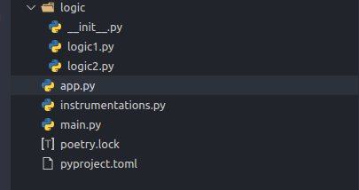
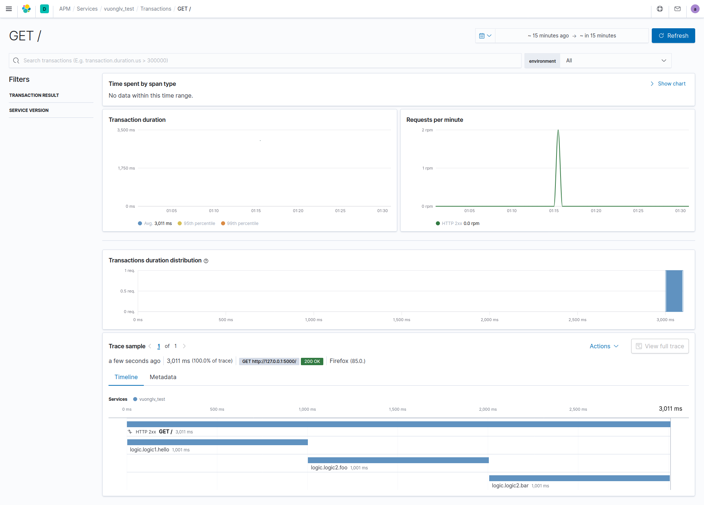

## Elastic APM Agent Utils
This package can help you create Elastic APM instrumentations using regex.

### Dependencies
1. `python3.6+`  
2. `elastic-apm`  

### Installation
```sh
pip install apm-agent-utils
```

### Usage
Create a file named `instrumentations.py`
```python
# instrumentations.py
from apm_agent_utils.instrumentation import InstrumentationBuilder

builder = InstrumentationBuilder("Test")
builder.add_instrument("logic.logic1", r"^hello.*")  # finding and wrapping your funtions by regex
builder.add_instrument("logic.logic2", r".*")

Test = builder.create_instrument()
```
In your `app.py`, adding the following lines at top of the file.  
```python
import elasticapm
from apm_agent_utils.utils import add_instrumentation

add_instrumentation("instrumentations.Test")
elasticapm.instrument()
```
==> `app.py`  
```python
# app.py
import elasticapm
from apm_agent_utils.utils import add_instrumentation
from elasticapm.contrib.flask import ElasticAPM
from flask import Flask

add_instrumentation("instrumentations.Instrument")
elasticapm.instrument()

app = Flask(__name__)
app.config['ELASTIC_APM'] = {
    'SERVICE_NAME': 'vuonglv_test',
    'SECRET_TOKEN': '#####',
    'SERVER_URL': 'http://##.##.##.##:8200/',
    'DEBUG': True
}

apm = ElasticAPM(app)
```
`main.py` - your controllers
```python
# main.py
from app import app

from logic.logic1 import hello
from logic.logic2 import foo, bar


@app.route("/")
def run():
    print(hello())
    print(foo())
    print(bar())
    return {"ok": True}


if __name__ == "__main__":
    app.run(debug=True)
```
Project structure look like this:  
  
Run app
```bash
python3 main.py
```
Get your endpoint
```curl
curl --location --request GET 'http://localhost:5000'
```
Goto your APM dashboard, result look like this:

